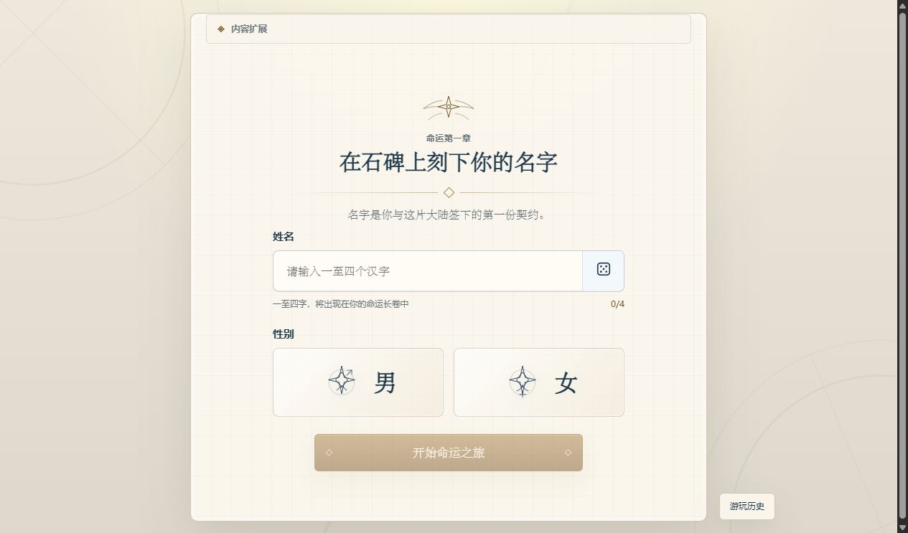
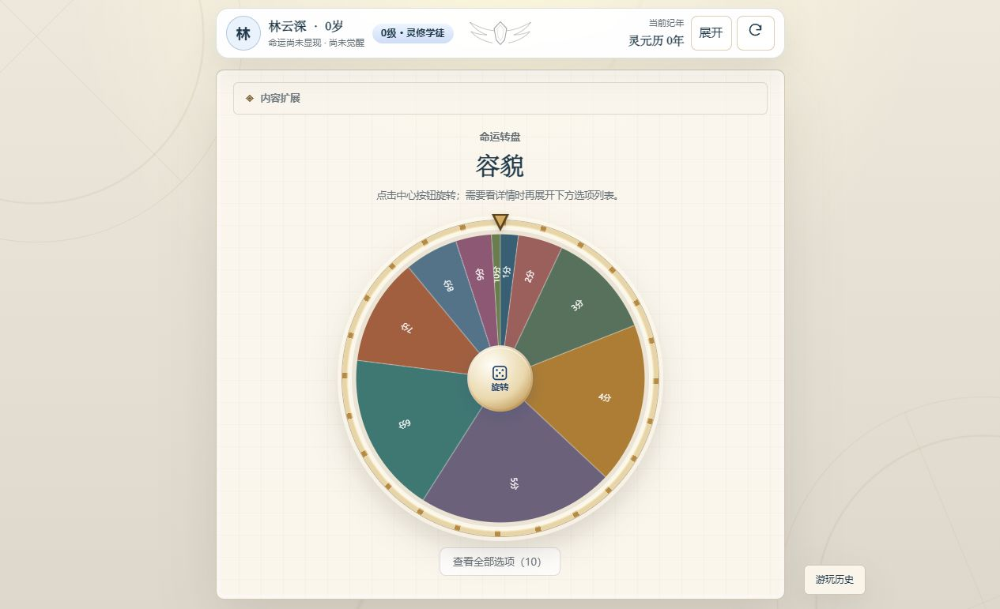

# Wheel of Life · 轮盘人生

[简体中文](README.md) | [English](README.en.md)

Wheel of Life is a Chinese-language life simulation game for the browser. Create a character with a fortune wheel, follow branching events, and reach different endings. Built with React, TypeScript, and Vite, it supports seeded randomness, automatic saves, and installable content packs.

[Play online](https://rowanjove.github.io/wheel-of-life/) · [Releases](https://github.com/rowanjove/wheel-of-life/releases) · [Report an issue](https://github.com/rowanjove/wheel-of-life/issues)

[](https://github.com/rowanjove/wheel-of-life/actions/workflows/ci.yml)
[](LICENSE)

The current public version is **v0.3.2**, targeting desktop and mobile browsers. The game interface and content are primarily Chinese; this English README does not imply an English game localization. The WeChat and Douyin miniapp workspace is frozen and is not part of this Web release.



## Gameplay and features

- Character creation: enter a name, select a gender, and replay creation using a random seed.
- Fortune wheel: determine appearance, era, birthplace, species, equipment, talents, and other attributes.
- Life progression: play through school stages, branching events, competitions, and adulthood.
- Save recovery: automatically save the current run and validate its snapshot before restoring it after a refresh.
- Content packs: replace creation rules, narrative content, and terminology.
- Touch support: use the wheel, buttons, and dialogs on mobile browsers.



## Run locally

Requires Node.js 18 or later. See [package.json](package.json) for the project's dependencies.

```bash
git clone https://github.com/rowanjove/wheel-of-life.git
cd wheel-of-life
npm ci
npm run dev
```

Open the address printed in the terminal, usually `http://127.0.0.1:5173/`. On Windows, you can also run `start-game.bat` from the repository root after installing Node.js.

| Command | Purpose |
| --- | --- |
| `npm run test:ci` | Run the tests once |
| `npm run typecheck` | Check TypeScript types |
| `npm run build` | Create a production build |
| `npm run mini:install` | Install dependencies for the frozen miniapp workspace |
| `npm run build:weapp` | Build the experimental WeChat miniapp |
| `npm run build:tt` | Build the experimental Douyin miniapp |

## Saves and content packs

The current run is stored in browser localStorage under `game-life:current-run-v1`. Clearing site data affects local saves; saves do not automatically sync between devices. Snapshots include a `packId`; restoration is rejected if it does not match the active content pack. Legacy `douluo-*` keys can be migrated.

The Web app accepts content packs from local ZIP files, same-origin URLs, or `/extensions/catalog.json`. Packs can override `creation`, `narrative`, and `lexicon`. Installation checks structure, allowed effects, size, and SHA-256 when provided by the manifest. Frontend HMAC checks detect corruption; they are not an authorization mechanism.

The miniapp workspace uses built-in content packs and does not provide the browser's pack installation workflow. See the [miniapp notes (Chinese)](miniapp/README.md).

## Project structure

- `src/content/`: pack registration, format validation, and integrity checks.
- `src/data/`: default content data.
- `src/rewrite/engine/`: game rules, state transitions, and randomness.
- `src/rewrite/storage/`: saves, snapshots, and recovery validation.
- `src/rewrite/store/`: Zustand state management.
- `src/rewrite/ui/`: React screens, wheel, and dialogs.
- `miniapp/`: frozen Taro adaptation workspace.

## Contributing and license

Run the tests, type checks, and production build before submitting changes. See the [contribution guide](CONTRIBUTING.md) and [release checklist](docs/RELEASE_CHECKLIST.md), currently in Chinese.

The wheel component draws on [spin-wheel](https://github.com/CrazyTim/spin-wheel). Code is licensed under the [MIT License](LICENSE); see [NOTICE](NOTICE) for content and attribution boundaries. Do not submit unauthorized text or assets from novels, animation, or games. Keep personal content packs out of public release assets. See [SECURITY.md](SECURITY.md) for security boundaries.
