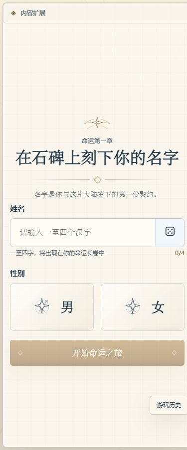
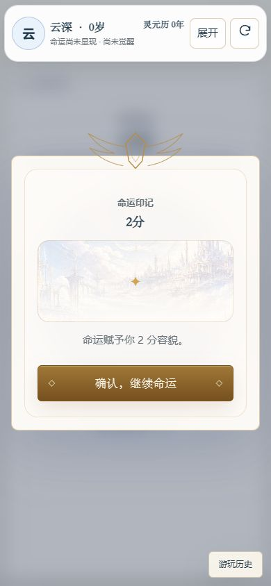
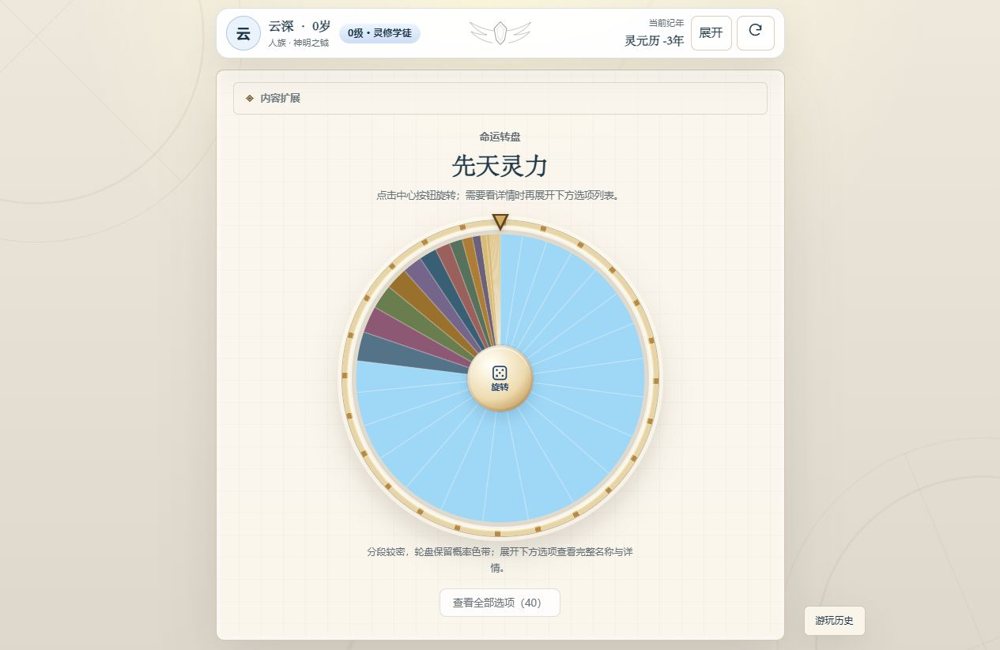
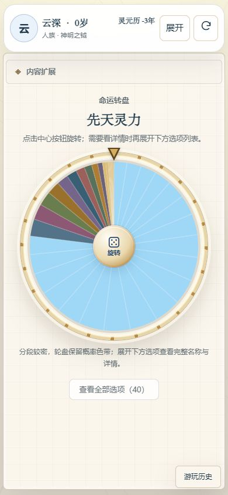

# game-life · 轮盘人生

[](https://github.com/rowanjove/game-life/actions/workflows/ci.yml)
[](LICENSE)

一个中文为主的随机人生 / 命运转盘游戏。你将在石碑上刻下姓名，逐步揭开容貌、时代、出生地、种族、命器与人生事件，走向属于自己的结局。

**在线试玩：** [GitHub Pages](https://rowanjove.github.io/game-life/)

> 当前公开版本聚焦 Web 端。微信小程序与抖音小程序工作区保留在 `miniapp/`，本次发布冻结，不作为 v0.3.0 的交付目标。

## 截图










## 已实现

- 角色创建：姓名、性别与可重放的种子随机数。
- 命运转盘：容貌、时代、出生地、种族、命器、天赋、武魂、魂环与魂骨等阶段。
- 完整流程：学院阶段、事件分支、大赛、成年线与多种结局。
- 可恢复存档：自动保存、快照校验、刷新后恢复当前人生。
- 内容包系统：`creation` / `narrative` / `lexicon` 可覆盖，支持浏览器同源 ZIP 安装。
- 响应式 UI：桌面与移动浏览器均可玩，按钮、对话框与转盘适配触屏操作。
- 测试与质量门禁：规则引擎、存档、内容校验、UI 流程均有测试，GitHub Actions 自动执行。

转盘组件参考 [spin-wheel](https://github.com/CrazyTim/spin-wheel) 的开源实现；游戏规则与默认基础内容为本项目原创泛化设定。

## 快速开始

### 环境要求

- Node.js 18+（推荐 Node.js 20）
- Windows 可直接运行根目录的 `start-game.bat`

### 安装与运行

```bash
npm install
npm run dev
```

打开终端提示的本地地址，默认是 `http://127.0.0.1:5173/`。

### 常用命令

| 命令 | 说明 |
| --- | --- |
| `npm run dev` | 启动 Vite 开发服务器 |
| `npm run test:ci` | 单次运行全部测试 |
| `npm run typecheck` | TypeScript 类型检查 |
| `npm run build` | 生产构建 |
| `npm run mini:install` | 安装冻结中的小程序工作区依赖 |
| `npm run build:weapp` | 构建微信小程序（实验性，非本次发布目标） |
| `npm run build:tt` | 构建抖音小程序（实验性，非本次发布目标） |

## 项目结构

```text
src/
  content/          # 内容包注册、schema、完整性校验
  data/             # Web 默认原创基础内容
  rewrite/
    engine/         # 纯 TypeScript 规则引擎 / reducer / RNG
    storage/        # localStorage 存档与快照校验
    store/          # Zustand 状态层
    ui/             # React 界面、转盘、弹窗、阶段屏幕
miniapp/            # 冻结中的 Taro 适配工作区，本版本不继续改动
docs/               # 设计、审查、发布与截图资料
```

存档 key 为 `game-life:current-run-v1`。存档带有 `packId`，与当前内容包不一致时会拒绝错误恢复；旧版 `douluo-*` key 会自动迁移。

## 内容扩展与版权边界

Web 端支持通过本地 ZIP、同源 URL 或 `/extensions/catalog.json` 安装内容包。安装时会校验包结构、effect 白名单、体积与 SHA-256（若 manifest 提供）。前端 HMAC 只用于损坏检测，不是安全授权机制。

本仓库只发布原创基础内容与代码。个人 / 同人内容包工作区不会进入公开仓库或 Release Assets；请勿提交未经授权的小说、动漫、游戏文本、角色名或商标。详见 [NOTICE](NOTICE) 与 [SECURITY.md](SECURITY.md)。

## 参与贡献

欢迎提交 Issue 与 Pull Request。提交前请运行：

```bash
npm run test:ci
npm run typecheck
npm run build
```

贡献规范见 [CONTRIBUTING.md](CONTRIBUTING.md)，发布检查清单见 [docs/RELEASE_CHECKLIST.md](docs/RELEASE_CHECKLIST.md)。

## 许可

MIT，见 [LICENSE](LICENSE)。
